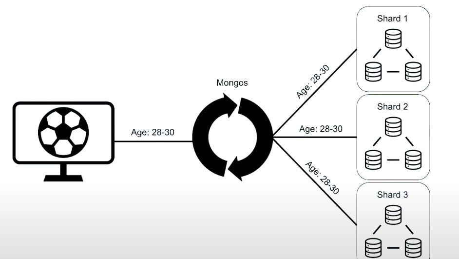
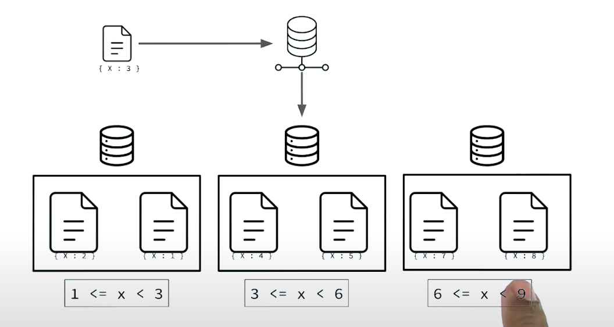

# Sharding
* As dataset grow to a size where a single machine can't handle the huge data and when vertical scaling is not a feasible solution
* Distributing data across machines by dividing data into pieces
* We call them as sharded cluster 
* To achieve fault tolerance and high availability we deploy sharded cluster as replicaSet
* Queries may become a bit query
    * We put a router process in between to direct the queries to appropriate shards
    * We call it mongos

## Mongos
* Can add as many mongos as we want depending on the needs of the system
* It is just a routing layer. The logic to route the query depends on metadata, 
* We have config servers which saves the metadata information about sharded cluster. 
* mongos is heavily dependent on config servers hence we generally deploy config servers as a replicated servers for achieving high availability  

# When to shard
## Indicators
Audit if it is economically viable to scale 
* DISK
* Memory
* CPU

If you reach a dead end
Ex: 10X cost increase gives you a performance boost of 2X

* Operational Complexity (20TB)
    * Higher data volume has direct impact on initial sync and backups and restore
    * Can be infrequent operations but can become operational issue when used
    * More disk usage ==> More indexes  ==> More RAM Usages 
    
## General rule of Thumb
* Individual Servers should contain 2-5TB of data
* Geographical Distributed data
* Single thread operations ==> Aggregation command (Not all steps can be parallelized)

# Sharding Architecture
Config servers need metadata in case if some shards grow big then data can be moved from one shard to another

## Primary Shard
* Every collection is assigned a priamry shard in a a sharded cluster which contains unsharded data. 
* This can be moved later on
    
* SHARD_MERGE at MongoS or any randomly choseen shard in cluster



## Setting up sharded cluster
Refer Atlas 
* Additional Settings
* M30 and UP
* Choose number of shards
* Sharded clusters cannot be converted to replica sets.

### Config DB
Connect to mongos
* Maintained internally by MongoDB
* Never write any data to it

```
sh.status()
```
Gives basic information about the sharded cluster. All these data is actually stored in config DB

Switch to config DB
```
use config
```

```
show collections
```

Let's look into databases collection

```
db.databases.find().pretty()
```
It will give insights about all the databases like primary shard, if it is partitioned

```
db.collections.find().pretty()
```
It will give us information about all the collections that has been sharded with additional shard metadata like shardKey

```
db.shards.find().pretty() 
```
Gives details about diffrent shards (Physical Machines) in our cluster

```
db.chunks.find().pretty()
```

Gives details about chunks within shards (Physical Machines) in our cluster
Each chunks keeps a lot of documents
Inclusive minimum and exclusive maximum defines the shard key values

```
db.mongos.find().pretty()
```
Details about mongos process
Never write unless until instructed by documentation or support engineer

# Shard Keys
* Index field/fields which MongDB uses to shard the collection and distribute data proportionately
* MongoDB interally partition the data based on range of shard keys and calls them as chunks
* The values of shard key choosen defines the inclusive lower bound and upper bounds of the chunks
* Hence Shard key should be present in every document present as well as inserted
* They also provide distributed read operations
* Ideally shard keys should support majority of queries that run on your collection so that read queries can be targetted to a single shard
* Without shard key targetting mongos will have to check all the shards for existence of document which we call as a broadcast operation/ scatter gather





## Important pointers for selecting shard keys
* Shard key Fields must be indexed (Hard requirement, can't select a key for sharding if it is not indexed)
* Sharding is a permanent operation. Once sharded you can't change shard keys post sharding. 
    * As of MongoDB 4.2, the shard key value is mutable ==> You can change the shard key value unless it is _id
    * As of 4.4, you can also refine shardkeys
    * [Details](https://docs.mongodb.com/manual/core/sharding-shard-key/index.html)
* Shard keys are immutable: You can't change the values of shard keys fields post sharding
* Shard keys are permanent ==> You can't unshard a collection

## Steps for sharding
1. Enable sharding on a database: This will not shard the collection. It just symbolizes that it is eligible for sharding 
```
sh.enableSharding("<database>");
```
2. Create an index on collection which we want to shard
```
db.collection.createIndex()
```
3. Shard a specific collection
```
sh.shardCollection("<database>.<collection>", {shardKey})
```
 
## Picking a good shard keys
1. Cardinality
2. Frequency
3. Monotonic Change

### Cardinality
* Should have high cardinality ==> many possible unique shardkey values
    * It constraints the number of shards that you can have
    * Direct impact on creation of chunks 
Ex: 
state, dayOfWeek, mongoEmployee(T/F)

### Frequency
* How often unique values exisit in our data
* High frequency ==> High repetition of a given unique shard key value
Ex: 90% of data insertion of shardKey whose value is NY  ==> Lead to hotspot
Recommendation ==> Low frequency

### Monotonic Change
* Avoid shard keys that change monotonically
* Ex: Timestamp values
* Due to chunk splitting ==> The ranges of chunks are made considering the existing documents in the collection
where MongoDB automatically defines the lower and upper bounds ==> if the keys are monotonically increasing then almost all of the operations will land to a specific node leading to hotspot. 

* Also it has impact of balancer

Note: 
* _id is a monotonically increasing field and we should not use it directly for shard key
* Test in staging environment first before moving to production

### Hashed Shard Key
* Shard key in which index used is hashed
* Data is not kept in hashed format, rather the index utilised is hashed

#### When to use?
To remove hotspot

#### Drawbacks
* Range keys lead to broadcast operations

## Chunks
Config servers hold mapping of chunks to shards

```
db.chunks.findOne();
```
* The diferent values of shardKey that our chunks can have are called keyspace
* As our chunks grow in size they get split into several others for even data distribution
* All documents of same chunk lie within the same shard
* If we had only one magnanimous chunk then we would have only one shard
* The number of chunks that our shard key allows may define the number of shards allowed in cluster

### ChunkSize
* 64 MB as MDB default chunksize
* chunksize can be configured between 1MB to 1GB
* Configurable at runtime

```
db.settings.save({_id: "chunksize", value: 2 })
```

* Chunking might not happen upfront. We need to import more data to see chunking in action
* Demo can be made here

* There is a component called balancer which distributes chunk across the nodes in cluster to keep everything balanced

### Jumbo Chunks
* If shard key has high frequency then chunks coresponding to this shardkey will grow exponentially
* This leads to hotspot. 
* They are generally larger than defined chuk size
* Can't move jumbe chunks
* Once marked as jumbo chunks balancers skips these chunks and avoid trying to move them
* In some cases these will not even split
* Strictly consider the frequency aspect of shard key to avoid the problems of JumboChunk
 
# Balancing
* MongoDB balancer identifies which shards has more number of chunks and automatically moves the chunk from one node to another
* Balancer runs on the primary member of config replica set
* It checks the chunk distribution of data across the sharded cluster and looks for certain migration threshold
* If imbalance detected, it initiates a balancer round
* A given shard can't particitpate in more than one chunk migration at a time
* It runs in parallel
* Balancer can split chunks if needed

Basic commands
```
sh.startBalancer(timeout, interval);
sh.stopBalancer(timeout, interval);
```
* If balancer is stopped in between it stops only when the balancing round is complete


# Queries in sharded cluster
1. Determine the specific shard(s) as per the query
2. Scatter gather can be very slow
3. Opens a cursor against each targetted shard
4. MongoS then merges all the data returned from these queries

## Specific notes on 
Sort ==> Pushes down each node and then performs a merge sort at mongos layer
Limit  ==> Pushes down each cluster and reapplies those limit again afterwards
Skip ==> Performed only on the mongos layer after we have the merged results
[Details on Aggregation](https://docs.mongodb.com/manual/core/aggregation-pipeline-sharded-collections/)